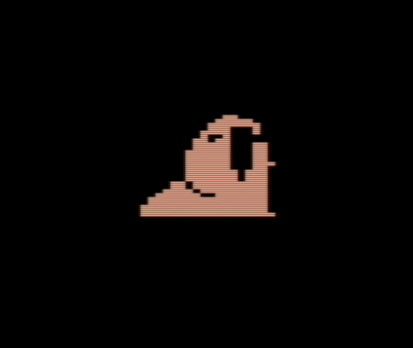

# Animated GIF to multicolor C64 sprite converter

GIFtoC64Sprites is a Windows tool for converting a GIF animation to Commodore 64 multicolor sprites. Based on the idea by [Jeff Harris](https://github.com/jeff-1amstudios/gif-to-c64-sprites) and his NodeJS code, this .NET tool adds support for [multicolor sprites](https://www.c64-wiki.com/wiki/Sprite#Color_settings).

## Download

Download the latest [release](https://github.com/kristofferjalen/gif-to-c64-sprites/releases).

## Usage

The source GIF animation needs to be resized to 48 x 42 pixels and color reduced to four colors. These four colors are selected by you. Use [Gifsicle](https://www.lcdf.org/gifsicle/) for this task: First pick four colors from the [Commodore 64 palette](https://www.c64-wiki.com/wiki/Color) that you think match the animation best. Then create a textfile `colors.col` with the RGB values of these four colors:

```
; Note that each of these colors must be represented in the C64 palette
0 0 0           ; Black ($00)
187 187 187     ; Light grey ($0f)
255 119 119     ; Light red ($0a)
0 136 255       ; Light blue ($0e)
```

Execute Gifsicle:

`gifsicle.exe --use-colormap colors.col --resize 48x42 --output prepared.gif input.gif`

Given a resized and color reduced GIF animation `prepared.gif`, execute the converter, passing the selected colors in the `colors` argument:

`GifToC64Sprites.exe --input prepared.gif --output sprite.spr --colors 0fae`

The result is a file `sprite.spr` with all frames for the top-left, followed by all frames for the bottom-left, then top-right, then bottom-right.

## Demo
The original Commodore 64 [example application](https://github.com/jeff-1amstudios/gif-to-c64-sprites/tree/master/c64-sample-app) by Jeff Harris needs some modifications to show multicolor sprites:

```
lda #%00001111 // multicolor (1) highres (0)
sta $d01c 
```

Store your four colors in the color registers:

```
lda #$00    // Black
sta $d021   // Background color

lda #$0f    // Light grey
sta $d025   // Multicolor register #0

lda #$0a    // Light red
sta $d026   // Multicolor register #1

lda #$0e    // Light blue
sta $d027   // Sprite #0 color
sta $d028   // Sprite #1 color
sta $d029   // Sprite #2 color
sta $d02a   // Sprite #3 color
```

The folder `c64-sample-app` contains a working minimal example, based on the original example, but written in [Kick Assembler](http://www.theweb.dk/KickAssembler/Main.html#frontpage) syntax.

Here is the application running in VICE:

